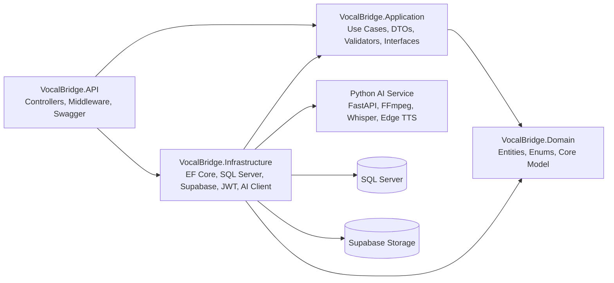
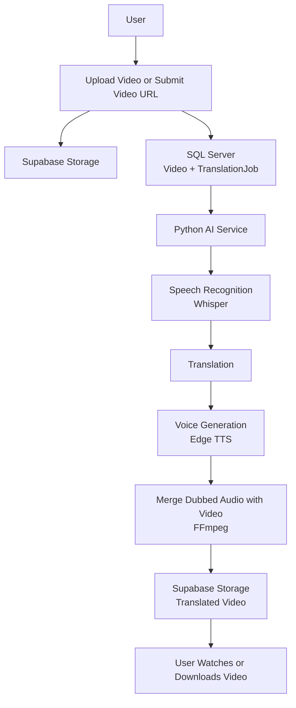
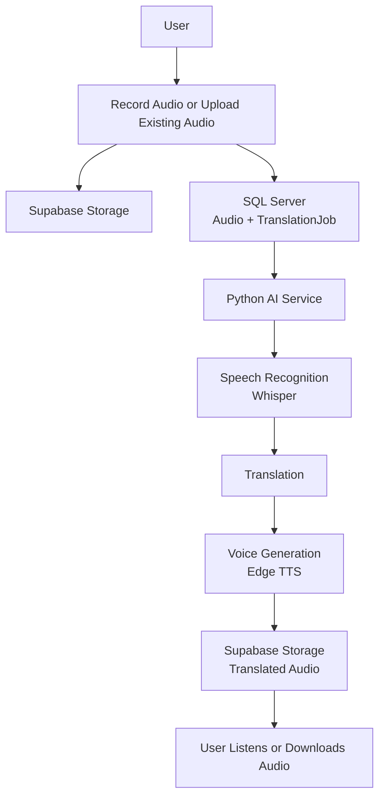
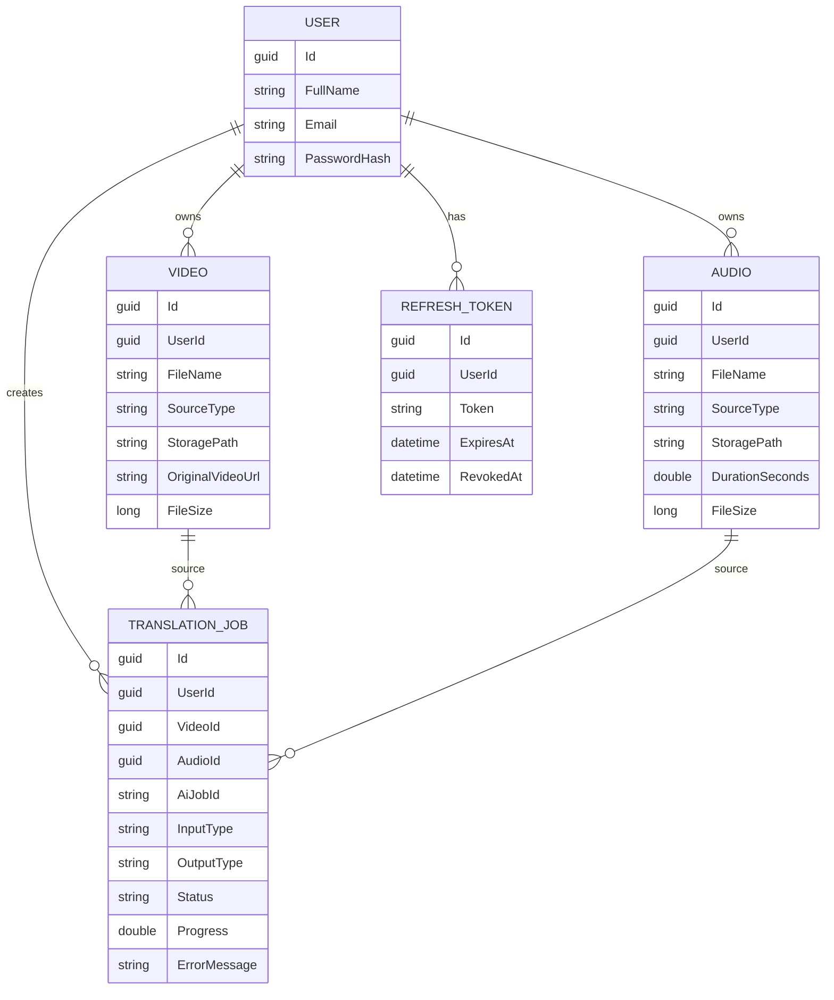

# Vocal Bridge

<p align="center">
  <strong>AI-powered media dubbing for video and audio workflows.</strong>
</p>

<p align="center">
  <a href="https://github.com/AbdelrahmanElgmaal/VocalBridge/stargazers"></a>
  <a href="#tech-stack"></a>
  <a href="#tech-stack"></a>
  <a href="#tech-stack"></a>
  <a href="#tech-stack"></a>
  <a href="#license"></a>
</p>

---

## 📖 Overview

**Vocal Bridge** is a full-stack, AI-powered media dubbing platform that translates and dubs both **videos** and **audio** into multiple languages.

The platform supports a complete media workflow: users can upload videos, submit video URLs, record voice directly from the browser microphone, upload existing audio, track AI processing, retry failed jobs, preview translated media, and download final dubbed outputs.

Vocal Bridge is designed as a production-style full-stack system with:

- **Clean Architecture** backend
- **Secure JWT authentication** and refresh tokens
- **React + TypeScript** SaaS dashboard
- **SQL Server** persistence
- **Supabase** media storage
- **Python FastAPI** AI processing service
- **Background job tracking** and webhook integration

---

## 📑 Contents

- [Overview](#-overview)
- [Feature Comparison](#-feature-comparison)
- [Features](#-features)
- [Architecture](#-architecture)
- [Tech Stack](#-tech-stack)
- [AI Pipeline Workflows](#-ai-pipeline-workflows)
- [Project Structure](#-project-structure)
- [Database Design](#-database-design)
- [Screenshots](#-screenshots)
- [API Documentation](#-api-documentation)
- [Installation](#-installation)
- [Environment Variables](#-environment-variables)
- [Build Verification](#-build-verification)
- [Author](#-author)
- [License](#-license)

---

## ⚖️ Feature Comparison

| Feature | Video | Audio |
|---|:---:|:---:|
| **Upload Media** | ✅ | ✅ |
| **Record from Microphone** | ❌ | ✅ |
| **Submit External URL** | ✅ | ❌ |
| **Preview Original** | ✅ | ✅ |
| **Preview Translated Result** | ✅ | ✅ |
| **Download Original** | ✅ | ✅ |
| **Download Result** | ✅ | ✅ |
| **Retry Failed Jobs** | ✅ | ✅ |
| **View in History** | ✅ | ✅ |
| **View in Dashboard** | ✅ | ✅ |
| **Delete Media** | ✅ | ✅ |

---

## ✨ Features

### 🔐 Authentication
- JWT-based login
- Refresh token rotation
- Secure protected routes
- Authorized media and job access per user

### 🎬 Video Dubbing
- Upload local video files
- Submit YouTube or external video URLs
- Store source media in Supabase Storage
- Create AI translation jobs
- Generate dubbed video output
- Watch translated videos online
- Download final translated media

### 🎙️ Voice Dubbing
- Record voice directly from the browser microphone
- Upload existing audio files (.mp3, .wav, .m4a, .webm, .ogg)
- Preview original audio before submission
- View audio duration and source type
- Translate and generate dubbed audio
- Listen to translated audio
- Download original audio or translated audio
- Delete audio and related translation jobs safely

### 🧠 AI Processing
- Python FastAPI AI service
- Background job lifecycle tracking
- AI queue-oriented workflow
- Progress tracking
- Retry failed jobs
- Webhook integration for AI status updates
- Resilience and failure handling when the AI service is unavailable

### 📊 Dashboard
- Total media statistics (Video and Audio counts)
- Total translation jobs metrics
- Processing, completed, and failed job metrics
- Success rate calculation
- Recent activity & recent media overview
- Preview and delete recent video/audio media
- Latest job status for each recent media item
- Quick actions for common workflows

### 📜 History
- Unified media history for video and audio jobs
- Search by media name and job ID
- Compact filter dropdown
- Sort by newest or oldest
- Retry failed jobs
- Audio duration, media type, source type, progress, and status badges

### 📁 Media Management
- List all uploaded videos and recorded/uploaded audios
- Clean up original and translated Supabase objects upon deletion
- Remove related translation jobs during deletion automatically

---

## 🏗️ Architecture

The backend follows **Clean Architecture**, separating business rules, application workflows, infrastructure concerns, and API delivery.

### Backend Projects

| Project | Responsibility |
|---|---|
| `VocalBridge.API` | HTTP API layer. Hosts controllers, authentication middleware, Swagger, CORS, exception handling, and request/response entry points. |
| `VocalBridge.Application` | Application business workflows. Contains DTOs, validators, service orchestration, interfaces, mappings, and use-case logic. |
| `VocalBridge.Domain` | Core domain model. Contains entities, enums, and business concepts such as `User`, `Video`, `Audio`, and `TranslationJob`. |
| `VocalBridge.Infrastructure` | External implementations. Contains EF Core persistence, SQL Server integration, Supabase storage, JWT services, AI service client, and hosted background workers. |

### Dependency Direction

Clean Architecture keeps dependencies flowing inward toward the domain.



---

## 🛠️ Tech Stack

### Backend
- **ASP.NET Core 9 Web API**: Backend API platform
- **C#**: Backend language
- **Entity Framework Core**: ORM and persistence
- **SQL Server**: Relational database
- **Clean Architecture**: Maintainable backend layering
- **FluentValidation**: Request validation
- **AutoMapper**: DTO mapping
- **JWT & Refresh Tokens**: Secure access and session continuity
- **Background Services**: Hosted workers for job polling

### Frontend
- **React**: UI framework
- **TypeScript**: Type-safe frontend development
- **Vite**: Fast frontend build tooling
- **React Query**: Server state and API caching
- **React Hook Form**: Form management
- **Tailwind CSS**: Utility-first styling
- **Shadcn UI**: UI component library
- **Lucide Icons**: Professional icon system

### Storage & Infrastructure
- **Supabase Storage**: Source media and translated output storage

### AI Service
- **Python**: AI service language
- **FastAPI**: AI service API
- **FFmpeg**: Audio/video processing
- **Whisper**: Speech recognition
- **Edge TTS**: Text-to-speech generation

---

## 🔄 AI Pipeline Workflows

### Video Workflow



### Audio Workflow



---

## 📁 Project Structure

```text
VocalBridge/
├── backend/
│   ├── VocalBridge.sln
│   └── src/
│       ├── VocalBridge.API/
│       ├── VocalBridge.Application/
│       ├── VocalBridge.Domain/
│       └── VocalBridge.Infrastructure/
├── frontend/
│   ├── src/
│   │   ├── components/
│   │   ├── hooks/
│   │   ├── lib/
│   │   ├── pages/
│   │   └── types/
│   ├── package.json
│   ├── tailwind.config.ts
│   └── vite.config.ts
├── api/             # Python AI API
├── models/          # AI Models
├── pipeline/        # AI Processing Pipeline
├── tests/
├── utils/
├── main.py
├── config.py
├── requirements.txt
└── README.md
```

---

## 🗄️ Database Design

### Relationships



---

## 📸 Screenshots

> *Add screenshots from your running application here.*

### Dashboard


### History


### Create Translation


### Record Voice


### Upload Audio


### Translation Details


### Swagger API


---

## 🔌 API Documentation

The backend exposes Swagger/OpenAPI documentation in development mode.
You can access it at `http://localhost:<port>/swagger` or `https://localhost:<port>/swagger`.

### Authentication
- `POST /api/auth/register` - Register a new user
- `POST /api/auth/login` - Login and receive JWT + refresh token
- `POST /api/auth/refresh` - Refresh access token
- `POST /api/auth/revoke` - Revoke refresh token

### Videos
- `POST /api/videos/upload` - Upload video to Supabase
- `GET /api/videos` - List current user's videos
- `GET /api/videos/{id}` - Get video details and signed URL
- `DELETE /api/videos/{id}` - Delete video and related files

### Audios
- `POST /api/audios/upload` - Upload recorded or existing audio
- `GET /api/audios` - List current user's audios
- `GET /api/audios/{id}` - Get audio details and signed URL
- `DELETE /api/audios/{id}` - Delete audio, translated outputs, and related translation jobs

### Translations / History
- `POST /api/translations` - Create a video or audio dubbing job
- `GET /api/translations` - List translation history
- `GET /api/translations/{id}` - Get translation job details
- `POST /api/translations/{id}/cancel` - Cancel active job
- `POST /api/translations/{id}/retry` - Retry failed or cancelled job

### Webhooks
- `POST /api/webhooks/ai-status` - Receive AI service job status updates

---

## 🚀 Installation

### Prerequisites
- [.NET 9 SDK](https://dotnet.microsoft.com/)
- [Node.js](https://nodejs.org/)
- [SQL Server](https://www.microsoft.com/sql-server)
- [Python 3.10+](https://www.python.org/)
- [FFmpeg](https://ffmpeg.org/)
- [Supabase](https://supabase.com/) project and storage bucket

### 1. Clone the Repository
```bash
git clone https://github.com/AbdelrahmanElgmaal/VocalBridge.git
cd VocalBridge
```

### 2. Configure SQL Server
Create a SQL Server database:
```sql
CREATE DATABASE VocalBridge;
```
Update the backend connection string in `backend/src/VocalBridge.API/appsettings.json` or user secrets.

### 3. Restore and Migrate Backend
```bash
cd backend
dotnet restore
dotnet ef database update --project src/VocalBridge.Infrastructure --startup-project src/VocalBridge.API
```

### 4. Run Backend API
```bash
dotnet run --project src/VocalBridge.API
```
*The API will start on `http://localhost:5031`*

### 5. Install and Run Frontend
```bash
cd ../frontend
npm install
npm run dev
```
*The frontend will run at `http://localhost:5173`*

### 6. Configure and Run Python AI Service
```bash
cd ..
python -m venv .venv
# Windows
.venv\Scripts\activate
# macOS/Linux
source .venv/bin/activate

pip install -r requirements.txt
python main.py
```
*The AI service will run at `http://localhost:8000`*

---

## 🔐 Environment Variables

Do not commit real secrets. Use local `.env`, user secrets, or deployment environment variables.

### Backend Example (`appsettings.json` / Secrets)
```json
{
  "ConnectionStrings": {
    "Default": "Server=localhost;Database=VocalBridge;TrustServerCertificate=true;User Id=<user>;Password=<password>;"
  },
  "Jwt": {
    "SecretKey": "<secure-long-secret>",
    "Issuer": "VocalBridge",
    "Audience": "VocalBridge",
    "AccessTokenExpirationMinutes": 30,
    "RefreshTokenExpirationDays": 7
  },
  "Supabase": {
    "Url": "<supabase-url>",
    "ServiceKey": "<supabase-service-key>",
    "BucketName": "<bucket-name>"
  },
  "AiService": {
    "BaseUrl": "http://localhost:8000",
    "WebhookSecret": "<shared-webhook-secret>",
    "WebhookCallbackUrl": "http://localhost:5031/api/webhooks/ai-status",
    "TimeoutSeconds": 30
  }
}
```

### Frontend Example (`.env`)
```env
VITE_API_BASE_URL=http://localhost:5031
```

### Python AI Service Example (`.env`)
```env
HOST=0.0.0.0
PORT=8000
DEBUG=true

WHISPER_MODEL=small
TARGET_LANGUAGE=ar

MAX_UPLOAD_SIZE_MB=500
MAX_CONCURRENT_JOBS=2

WEBHOOK_SECRET=<shared-webhook-secret>
```

---

## 🧪 Build Verification

Use these commands before submitting changes or deploying the project.

**Backend**
```bash
dotnet build backend/VocalBridge.sln
```

**Frontend**
```bash
cd frontend
npm run build
```

---

## 🎓 Author

| Field | Details |
|---|---|
| **Name** | Abdelrahman Elgmaal |
| **Project** | Graduation Project |
| **GitHub** | [@AbdelrahmanElgmaal](https://github.com/AbdelrahmanElgmaal) |

---

## 📄 License

This project is licensed under the **MIT License**.

```text
MIT License

Copyright (c) 2026 Abdelrahman Elgmaal

Permission is hereby granted, free of charge, to any person obtaining a copy
of this software and associated documentation files (the "Software"), to deal
in the Software without restriction, including without limitation the rights
to use, copy, modify, merge, publish, distribute, sublicense, and/or sell
copies of the Software, and to permit persons to whom the Software is
furnished to do so, subject to the following conditions:

The above copyright notice and this permission notice shall be included in all
copies or substantial portions of the Software.

THE SOFTWARE IS PROVIDED "AS IS", WITHOUT WARRANTY OF ANY KIND, EXPRESS OR
IMPLIED, INCLUDING BUT NOT LIMITED TO THE WARRANTIES OF MERCHANTABILITY,
FITNESS FOR A PARTICULAR PURPOSE AND NONINFRINGEMENT. IN NO EVENT SHALL THE
AUTHORS OR COPYRIGHT HOLDERS BE LIABLE FOR ANY CLAIM, DAMAGES OR OTHER
LIABILITY, WHETHER IN AN ACTION OF CONTRACT, TORT OR OTHERWISE, ARISING FROM,
OUT OF OR IN CONNECTION WITH THE SOFTWARE OR THE USE OR OTHER DEALINGS IN THE
SOFTWARE.
```
